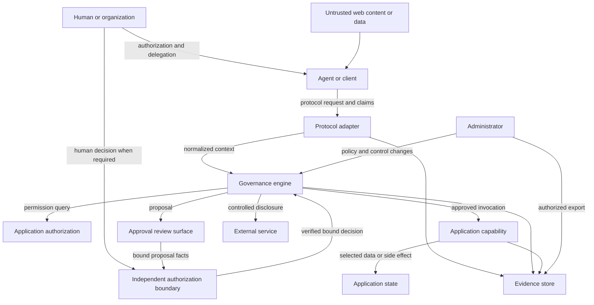

# Threat Model

**Version:** Draft 0.1  
**Status:** Design threat model, not a vulnerability report  
**Last reviewed:** 2026-09-04

All attacker stories in this document are hypotheses for design and testing.
This repository currently contains specifications, executable conformance
tooling, an in-memory reference kernel, and an experimental read-only WordPress
plugin, not a production governance implementation. No story below is a
confirmed vulnerability.

## 1. Overview

### Intended use

The proposed system governs application capabilities invoked by AI agents or
automated clients under human or organizational authority. It normalizes
requests, restricts existing application authority through policy and
delegation, requests exact-action approval when needed, controls external data
transmission, applies budgets, and records evidence. When policy requires human
approval, it must also establish the decision through an authorization boundary
outside the requesting agent's delegated automation authority.

WordPress 7.1+ is the first reference platform. The initial path uses WordPress
Abilities as application capabilities and the official WordPress MCP Adapter as
the MCP integration. The design requires application permission to remain
authoritative (`SPEC.md:87-125`, `mappings/WORDPRESS.md:49-64`).

### Components and design evidence

| Component | Responsibility | Design evidence |
|---|---|---|
| Protocol adapter | Authenticate protocol claims, normalize requests, call governance, map safe results | `SPEC.md:412-434` |
| Governance engine | Classify, evaluate policy, delegation, approval, transmission, and budgets | `SPEC.md:166-266`, `GOVERNANCE.md:15-63` |
| Application authorization | Decide whether the effective application principal may invoke the capability | `SPEC.md:120-125`, `mappings/WORDPRESS.md:157-169` |
| Pending action and approval | Bind an authorized reviewer's independently verified decision to an exact, expiring proposal | `SPEC.md:294-354`, `GOVERNANCE.md:131-172`, [RFC 0003](rfcs/0003-human-authorization-assurance.md) |
| External-transmission control | Separately decide whether governed data may leave the application | `SPEC.md:355-383`, `GOVERNANCE.md:173-200` |
| Evidence service/store | Record proposal, decision, approval, execution, and export events with redaction | `EVIDENCE.md:15-79`, `EVIDENCE.md:120-149` |
| Administrative UI/API | Manage policies, classifications, delegations, approvals, evidence, and emergency controls | `GOVERNANCE.md:255-277` |
| WordPress integration | Map users, Abilities, permissions, MCP Adapter, and optional Agents API contracts | `mappings/WORDPRESS.md:17-64` |

### Primary data flow

### Effective resources and unresolved implementation choices

| Deployment or workflow | Resource or capability | Configuration and precedence | Safe effective value or location | Readers, writers, or recipients | Enforcing control | Evidence or unknowns |
|---|---|---|---|---|---|---|
| WordPress capability call | WordPress user authority | Current user roles, object state, Ability permission callback, then stricter governance | Effective permission at execution time | Adapter, governance, Ability | WordPress permission callback plus governance deny layer | The experimental path uses `wp_ability_permission_result` and satisfies Stage 1 for its documented path; broader production coverage remains unproven |
| Delegated agent action | Delegation grant | Core invariants, site policy, profile, delegation, capability/resource rules | Exact active grant referenced by `delegation_id` | Governance and authorized administrators | Delegation validation and execution-time re-check | Behavioral model at `GOVERNANCE.md:99-130`; storage is not selected |
| Consequential action | Canonical proposal and approval | Request fields, policy version, expiry, approver authority, decision provenance and assurance | Immutable proposal plus digest and independently verified decision when human approval is required | Governance, authorized reviewer, authorization adapter, executor | Exact-request binding, independent human-authorization boundary, and replay control | [RFC 0001](rfcs/0001-canonical-action-representation.md) defines canonicalization; accepted [RFC 0003](rfcs/0003-human-authorization-assurance.md) defines decision provenance but is not implemented |
| External AI/service use | Selected application data | Read permission, data class, recipient, purpose, minimization, organization policy | Minimum approved payload | Named external recipient | Separate transmission decision | Required by `GOVERNANCE.md:173-200`; recipient integrations do not exist yet |
| Operational accountability | Evidence events | Schema version, redaction, access, retention, export policy | Restricted append-oriented store or stronger profile | Authorized operators, reviewers, export recipients | Storage ACLs, redaction, integrity mechanism | Requirements at `EVIDENCE.md:207-264`; storage and integrity level remain open |
| Administration | Policy and approval authority | WordPress/application authorization plus CSRF/request integrity | Authorized application role | Administrators and approvers | Capability checks, request-forgery protection, evidence | Required by `GOVERNANCE.md:255-277`; concrete roles are not defined |

## 2. Threat Model, Trust Boundaries, and Assumptions

### Protected assets

- Application content, settings, identities, permissions, and operational state.
- Personal, sensitive, confidential, and unpublished application data.
- Human and organizational authority represented by application principals.
- Delegation grants, approval decisions, and pending actions.
- Integrity of human decision provenance and authorization-assurance claims.
- Policy definitions, classifications, provider metadata, and emergency controls.
- Evidence confidentiality, integrity, availability, and correlation.
- External provider credentials and other reusable secrets.
- Availability budgets, monetary limits, and rate counters.
- The invariant that protocol adapters cannot widen application authority.

### Security objectives

1. Application denial cannot be overridden by governance or an adapter
   (`SPEC.md:120-125`).
2. Every supported external action crosses the same governance boundary
   (`SPEC.md:474-497`).
3. Approval applies only to the exact request and expires
   (`SPEC.md:294-354`).
4. A requesting agent cannot originate accepted evidence for required human
   approval through its delegated automation authority
   ([RFC 0003](rfcs/0003-human-authorization-assurance.md)).
5. Permission, delegation, policy, budget, and approval are re-checked before
   side effects (`GOVERNANCE.md:218-248`).
6. Client, agent, and application-principal identities remain distinct; unknown
   identity is not invented (`SPEC.md:166-200`).
7. External disclosure requires a separate policy decision
   (`SPEC.md:355-383`).
8. Evidence excludes reusable secrets and is access-controlled
   (`EVIDENCE.md:120-149`, `EVIDENCE.md:207-223`).
9. Administrative changes are authorized, request-forgery protected, and
   evidenced (`GOVERNANCE.md:255-277`).
10. Payload, rate, iteration, retry, and cost limits fail safely
   (`SPEC.md:384-398`, `GOVERNANCE.md:201-217`).

### Actors and realistic starting capabilities

**Unauthenticated remote attacker**

- Can send network requests to publicly reachable protocol or application
  endpoints and supply malformed or oversized data.
- Does not initially possess an authenticated WordPress user, valid delegation,
  approval role, policy-administration role, or evidence-store access.

**Authenticated low-privilege application user**

- Can exercise their legitimate WordPress/application permissions and may
  authorize a client within supported flows.
- Does not initially possess administrator authority or permission over other
  users' resources.

**Malicious or compromised agent/client**

- Can select calls, arguments, timing, retries, and protocol metadata within its
  connection and may misrepresent unverified agent identity.
- May automate browser or application DOM controls when its host permits, but
  must not thereby gain access to a required human-authorization channel.
- May possess valid client authentication or delegated authority, but should not
  gain capabilities outside the bound principal, grant, resource, or budget.

**Malicious content author or external data source**

- Can place prompt-injection instructions or misleading data in content the
  agent reads.
- Does not initially possess the agent's application credentials or direct
  policy-administration access.

**Authorized approver**

- Can decide actions within their approval role.
- Must make required human decisions through a boundary whose provenance is
  independently verified; account authority alone does not establish this.
- Must not be able to approve a changed request, exceed their application
  authority, or silently rewrite policy unless separately authorized.

**Site administrator or governance operator**

- Can change policy within their legitimate administrative role.
- Is trusted for that granted authority, but their account remains exposed to
  CSRF, session theft, mistakes, and over-broad role design.

**External AI or service provider**

- Receives only data explicitly transmitted to it and then operates under its
  own technical and contractual controls.
- Must not be assumed to honor unverified retention, region, or training-use
  metadata.

**Upstream or plugin supply-chain actor**

- Can publish code or updates to a dependency used by an implementation.
- Does not automatically have authority to change a site's policy, but a
  compromised installed update may execute with plugin/application privilege.

### Trust boundaries

| Boundary | Data or authority crossing | Required control | Failure capability |
|---|---|---|---|
| Network/client -> protocol adapter | Requests, claims, arguments, trace data | Authentication, issuer validation, schema and size validation, rate limits | Invoke or exhaust externally reachable handlers |
| Adapter -> governance | Normalized identity and action context | Claim provenance, identity separation, complete context, fail closed | Confuse client/agent/user or omit policy-relevant facts |
| Governance -> application | Request to exercise application authority | Application permission plus stricter governance | Confused deputy or privilege escalation |
| Untrusted content -> agent decision | Natural language, retrieved records, tool metadata | Treat as data, bounded capabilities, policy, independent human authorization where required | Indirect prompt injection drives a harmful action |
| Agent or host -> human-authorization boundary | Proposal reference, UI activity, claimed decision source | Independent channel, approver authorization, verified and bound provenance, fail closed | Agent self-approves through an automatable review surface |
| Proposal -> reviewer -> executor | Exact action and decision | Structured preview, approver authorization, decision provenance, digest, expiry, replay control | Self-approval, bait-and-switch, or replay |
| Application -> external service | Selected data and purpose | Separate recipient policy, minimization, approval, evidence | Personal or confidential data disclosure |
| Components -> evidence store | Identity, decision, result, metadata | Redaction, ACLs, integrity, retention | Secret leakage, tampering, or accountability loss |
| Administrator -> governance state | Policy, classifications, delegations, provider metadata | Application authorization, CSRF protection, versioning, evidence | Disable controls or create over-broad policy |
| Upstream package -> implementation | Executable code and contract changes | Version pinning, review, compatibility tests, feature detection | Bypass controls or break security assumptions |

### Assumptions and exclusions

- No production implementation, external endpoints, durable storage schema,
  deployment, or credentials exist in this repository yet.
- The model assumes HTTPS for remote integrations but does not assume network
  isolation, a WAF, or a particular hosting provider.
- WordPress is the reference mapping; non-WordPress implementations must define
  their own application authorization boundary.
- A fully compromised WordPress/site administrator already holds broad site
  authority. Effects limited to that existing authority are not a new privilege
  escalation, though evidence integrity and organizational separation may still
  matter.
- External provider contract terms and administrator-entered metadata are not
  independently verified by the governance system.
- Prompt injection cannot be completely prevented by this layer; the objective
  is to bound the authority and impact available to a compromised decision path.
- A page cannot reliably distinguish human intent from agent-host automation
  without a trusted host, platform, or application authorization primitive that
  is outside the requesting agent's delegated authority.
- WebMCP issue 288 records one observed run and supports this attacker
  capability as a design hypothesis. It is not assumed to describe every user
  agent or to prove a vulnerability in this repository.
- Cancellation and rollback depend on the application capability and external
  service. The specification does not assume every action is reversible.
- Durable storage, evidence integrity, multisite scope, role mappings, a
  production human-authorization adapter, and production use of canonical
  action version 1 remain unresolved.
- Architecture review was performed sequentially from the repository design
  documents and reference kernel. It was not an independent review, and the
  reference tests do not establish production security.

## 3. Attack Surface, Mitigations, and Attacker Stories

| Priority | Scenario and capability gain | Prerequisites | Impact | Existing controls | Mitigation | Evidence |
|---|---|---|---|---|---|---|
| P0 | **Hypothesis: adapter bypass.** An attacker finds a REST, MCP, CLI, or direct Ability path that invokes the capability without governance. Gains the full application authority of the effective principal outside policy. | An enabled external path is not covered by the chosen interception point. | Unauthorized disclosure or state change; governance and evidence become incomplete. | Core forbids adapter bypass; WordPress permission remains mandatory. | Enumerate every supported entry point, centralize enforcement at an upstream-supported boundary, add negative integration tests, fail closed when integration is unavailable. | `SPEC.md:412-434`, `SPEC.md:474-497`, `mappings/WORDPRESS.md:95-126` |
| P0 | **Hypothesis: confused deputy / permission widening.** A client causes governance or a plugin handler to execute with an administrator or service identity instead of the bound application principal. | Identity mapping or execution context restoration is incorrect. | Cross-user data access, publication, settings changes, or account impact. | Application permission must be authoritative; identities must remain distinct. | Bind principal at authorization, validate claim provenance, avoid ambient admin identities, re-check object-level permission immediately before execution. | `SPEC.md:120-200`, `mappings/WORDPRESS.md:157-192` |
| P0 | **Hypothesis: prompt injection drives an authorized but unintended action.** Malicious content instructs a tool-using agent to publish, delete, disclose, or call an external service. | Agent reads attacker-controlled content and has a relevant delegated capability. | Harmful action within the agent's available authority, potentially at scale. | Untrusted-input invariant, least privilege, policy, approval, budgets, evidence. | Separate instructions from data, minimize delegated capabilities, require structured proposals and independently verified human authorization for consequential effects where policy requires it, constrain recipients and iterations. | `SPEC.md:474-497`, `GOVERNANCE.md:131-217`, [RFC 0003](rfcs/0003-human-authorization-assurance.md) |
| P0 | **Hypothesis: approval bait-and-switch or replay.** A client obtains approval for benign arguments, then changes the target/payload or reuses the approval. | Weak canonicalization, missing expiry, or no execution-time binding. | Unauthorized consequential action presented as approved. | Exact-request hash, expiry, single-use posture, execution-time re-check. | Apply RFC 0001 canonicalization, bind every impact-relevant field, use one-time replay state, invalidate on policy/target changes, and run the shared edge-case and lifecycle fixtures. | `SPEC.md:294-354`, `EVIDENCE.md:80-119`, `GOVERNANCE.md:131-172`, `rfcs/0001-canonical-action-representation.md` |
| P0 | **Hypothesis: an agent self-satisfies required human approval through an automatable UI.** The same agent host invokes a proposal tool and activates the page's Approve control. | The host can invoke tools and automate the review DOM; the application equates page activity, session state, or a nonce with human intent. | A consequential action executes without the human decision promised by policy. | Exact-request binding and approver authorization limit other approval attacks but do not establish decision provenance. | Use an authorization adapter outside the agent's delegated automation authority, bind its verified result to the request hash and approver, and fail closed on missing or failed verification. | [RFC 0003](rfcs/0003-human-authorization-assurance.md), [`mappings/WEBMCP.md`](mappings/WEBMCP.md), [WebMCP issue 288](https://github.com/webmachinelearning/webmcp/issues/288) |
| P0 | **Hypothesis: unauthorized external transmission.** An agent that may read WordPress data sends it to an unapproved AI provider or purpose. | Read permission is incorrectly treated as disclosure permission, or recipient context is omitted. | Personal, sensitive, confidential, or contractual data exposure. | Separate transmission policy and data classes. | Require named recipient and purpose, minimize/redact payload, evaluate provider metadata, require approval where policy says, record recipient without copying full payload. | `SPEC.md:355-383`, `GOVERNANCE.md:173-200`, `EVIDENCE.md:167-206` |
| P1 | **Hypothesis: forged or conflated identity.** Self-asserted client metadata is treated as a trusted agent identity or delegation subject. | Adapter fails issuer/signature validation or maps client == agent == user. | Access to identity-specific policy, quotas, or grants. | Identity honesty and claim provenance requirements. | Store issuer and validation status, use adapter-specific trust rules, omit unknown identity from the canonical action, and key budgets only on reliable identities. | `SPEC.md:166-200`, `SPEC.md:384-398` |
| P1 | **Hypothesis: stale authorization after review.** User role, object ownership, policy, delegation, or budget changes between approval and execution. | Execution trusts proposal-time state. | Action executes after authority was removed or scope changed. | Execution-time re-check lifecycle. | Re-evaluate all mutable controls, invalidate approvals on material policy change, use target version/precondition checks for race-prone resources. | `GOVERNANCE.md:218-248`, `GOVERNANCE.md:278-299` |
| P1 | **Hypothesis: policy administration compromise.** CSRF, weak role mapping, or session theft changes policies, classifications, provider approvals, or emergency controls. | Authorized admin browser or endpoint lacks request integrity or least-privilege role checks. | Broad weakening of future decisions and concealment of data flows. | Administrative authorization, CSRF protection, policy versioning, evidence. | Use narrow capabilities, nonces/request-forgery protection, step-up auth for high-impact policy changes, immutable versions, alerts and reviewable diffs. | `GOVERNANCE.md:255-299` |
| P1 | **Hypothesis: evidence leaks secrets or personal data.** Full arguments, results, headers, prompts, or exports are logged. | Generic logging or debug mode captures sensitive payloads. | Secondary data breach; credentials may enable broader compromise. | Explicit secret exclusions and minimization rules. | Allowlist evidence fields, capability-specific redaction, separate protected incident artifacts, test nested and encoded secret forms, restrict exports. | `EVIDENCE.md:120-149`, `EVIDENCE.md:224-264` |
| P1 | **Hypothesis: evidence tampering or silent loss.** An attacker with application write access modifies or deletes events, or logging fails while actions continue. | Evidence shares the same authority as ordinary plugin data and has no failure visibility. | Loss of accountability, incident reconstruction, and approval proof. | Append-oriented design and documented integrity limits. | Restrict write/delete capabilities, monitor pipeline failure, use signed export manifests or external append storage for stronger profiles, evidence deletion/export. | `EVIDENCE.md:207-264` |
| P1 | **Hypothesis: SSRF through governed capability or provider configuration.** Agent-controlled URL or recipient causes server-side requests to internal or metadata services. | A capability accepts URLs or provider endpoints without destination controls. | Internal network access, credential theft, or data exfiltration. | Schema validation and external-transmission policy are required at core level. | URL allowlists, DNS/IP revalidation, redirect limits, block local/link-local ranges, WordPress HTTP hardening, capability-specific egress policy. | `SPEC.md:355-383`, `mappings/WORDPRESS.md:283-301` |
| P1 | **Hypothesis: resource exhaustion and cost amplification.** A client floods expensive tools, nested agent loops, approvals, evidence, or exports. | Reachable endpoint and missing or bypassable budgets. | Site outage, storage growth, provider charges, review fatigue. | Operational budget requirements and fail-closed exhaustion. | Layer payload, rate, concurrency, iteration, retry, cost, and storage quotas; backpressure; bounded cleanup; avoid trusting attacker-selected identity keys. | `SPEC.md:384-398`, `GOVERNANCE.md:201-217` |
| P2 | **Hypothesis: capability or Agent Card over-disclosure.** Public discovery exposes private schemas, internal abilities, identities, or implementation details. | Discovery defaults are broad or metadata is copied without review. | Reconnaissance, privacy exposure, easier targeting. | Protocol-native discovery and explicit exposure posture. | Public/private views, least disclosure, authenticated extended metadata, metadata review, never publish secrets. | `SPEC.md:412-434`, `mappings/A2A.md:34-60` |
| P2 | **Hypothesis: upstream contract drift or compromised dependency.** A WordPress, MCP Adapter, Agents API, or protocol update changes hook order or bypasses an assumed control. | Automatic update, loose version constraints, or insufficient compatibility tests. | Enforcement failure, denial of service, or plugin-level compromise. | Adapter boundary, feature detection, upstream decision rule. | Pin/test supported versions, fail closed on missing hooks, release compatibility matrix, dependency provenance and review, monitor upstream security notices. | `mappings/WORDPRESS.md:17-48`, `mappings/WORDPRESS.md:302-310` |
| P2 | **Hypothesis: cross-site or multisite scope confusion.** A network-level agent, policy, or evidence query crosses site boundaries. | Multisite ownership/storage semantics are undefined. | Cross-tenant disclosure or unauthorized action. | Multisite is explicitly unresolved. | Define site/network ownership before support, use site-scoped keys and queries, enforce tenant context at every store and adapter, add isolation tests. | `OPEN-QUESTIONS.md:49-53` |

### Coverage notes

- Arbitrary shell, PHP, SQL, and unrestricted filesystem tools are non-goals. If
  a future implementation adds them, this model must be revised because the
  privilege and impact boundary changes materially.
- OAuth authorization-server internals are outside the current design. A future
  bundled authorization server requires its own credential, redirect, client
  registration, token, issuer, and revocation review.
- Financial actions are classified but not designed. Any implementation needs a
  domain-specific threat model for payment authorization, amount/currency
  binding, fraud, refunds, and legal obligations.
- The experimental WordPress plugin and deployed acceptance test prove Stage 1
  for the documented WordPress 7.1 plus MCP Adapter 0.6.1 path. They do not
  establish coverage for future write, approval, WebMCP, or other application
  paths.

## 4. Severity Calibration

Severity describes the capability gained if a hypothesis is validated in an
actual implementation. Confidence and missing evidence are tracked separately.

### Critical

Examples:

- unauthenticated or low-privilege remote execution of arbitrary PHP, shell,
  SQL, or filesystem operations;
- systemic bypass that gives arbitrary users administrator-equivalent WordPress
  authority across many sites;
- compromise of reusable credentials that grants broad external provider or
  infrastructure control.

Counterexamples:

- an administrator intentionally changing a policy within their existing full
  authority, without crossing a promised organizational separation boundary;
- denial of one low-cost public read operation.

### High

Examples:

- cross-user access to private WordPress records through confused principal
  mapping;
- unapproved publication, destructive changes, account modification, or bulk
  personal-data transmission;
- reusable approval replay for consequential actions;
- agent self-approval of a consequential action where policy promises
  independently verified human authorization;
- governance bypass on a broadly deployed authenticated adapter.

Severity may fall when exposure requires a rare, disabled feature or the action
is narrowly reversible and independently detected.

### Medium

Examples:

- disclosure of limited internal metadata or one user's non-public content;
- stored policy or evidence manipulation requiring a lower-privilege site role;
- bounded denial of service or provider cost amplification;
- approval/UI ambiguity that neither bypasses structured request binding nor a
  required independent human-authorization boundary.

### Low

Examples:

- minor capability-name or version disclosure without sensitive metadata;
- low-impact audit inconsistency that does not hide consequential actions;
- rate-limit accuracy issues with no meaningful availability or cost impact.

### Unsupported or outside the current boundary

- Claims that the specification itself has a remotely exploitable vulnerability
  are unsupported until runnable code exists.
- A threat requiring prior control of the WordPress administrator is not a new
  application privilege escalation unless the system promises separation from
  that administrator, stronger evidence integrity, or protection of another
  tenant or external authority.
- Universal agent reputation attacks, decentralized identity compromise, and
  agent marketplace fraud are outside scope because those systems are non-goals.

## 5. Model maintenance

Revise this threat model when:

- runnable reference code is added;
- a concrete WordPress interception point is selected;
- storage or deployment architecture is chosen;
- write delegation or approval execution is implemented;
- a human-authorization adapter or WebMCP integration is implemented;
- external provider integrations are added;
- A2A or asynchronous work is implemented;
- multisite support is defined;
- an authorization server or financial capability enters scope.

Once code exists, replace design-section citations with source-backed entry
points, actual enforcing controls, effective storage locations, and tested
deployment paths.
